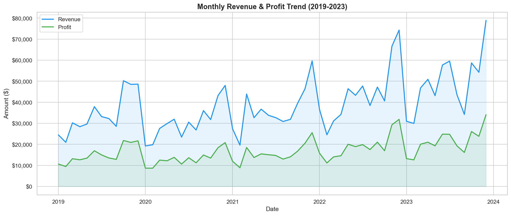
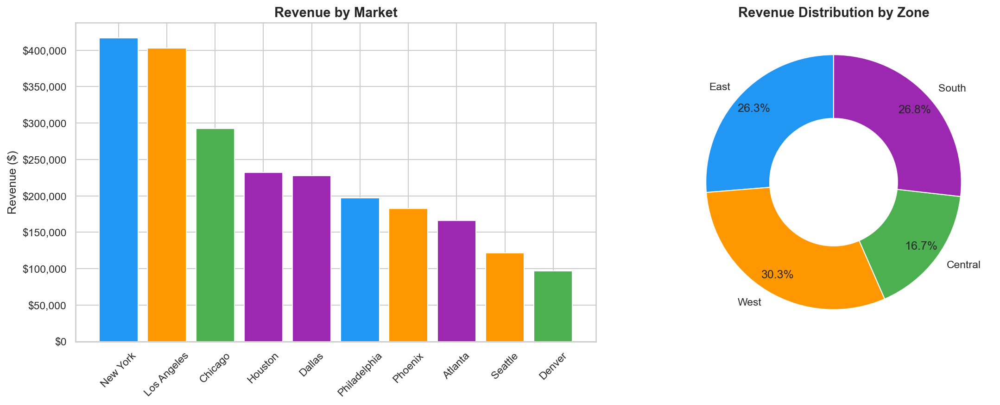
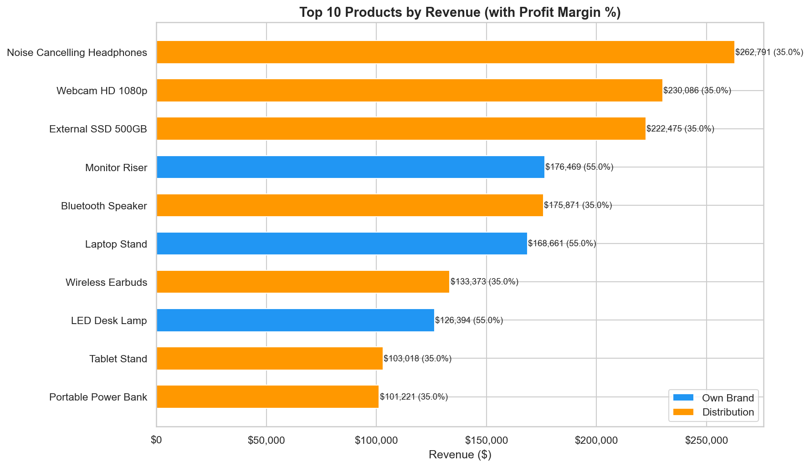
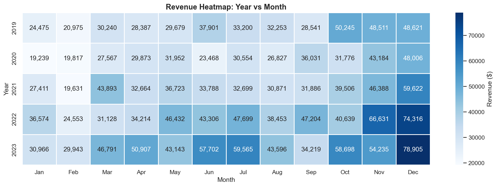
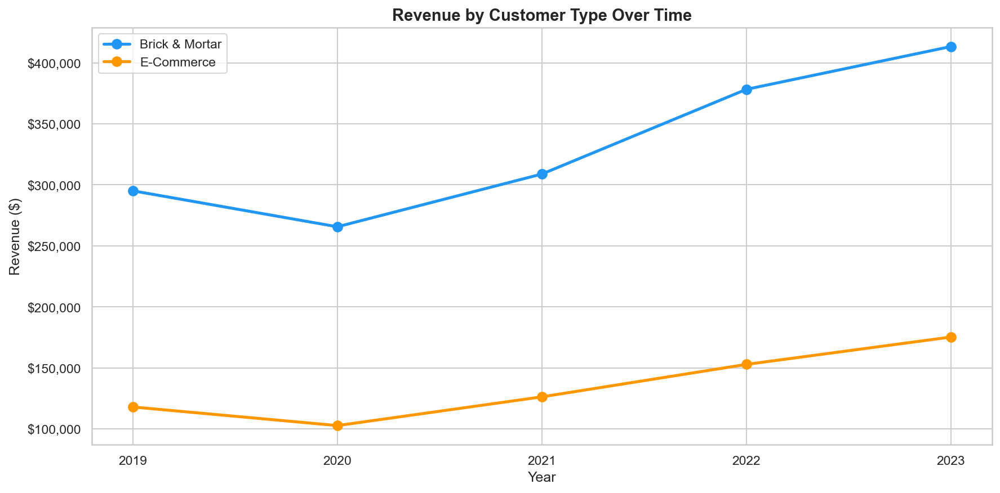

# Sales Insights for Consumer Business

Built a sales insight solution that helps bring data-informed decision-making using Python connected with SQL to perform exploratory data analysis and visualization.

## Overview

This project analyzes 5 years (2019-2023) of sales transaction data for a consumer electronics business across 10 U.S. markets. Using Python and SQL (SQLite), it uncovers revenue trends, customer behavior, product performance, and regional sales patterns to support strategic business decisions.

## Key Insights

- **Revenue Growth**: 35%+ growth from 2019 to 2023, with strong recovery after 2020 dip
- **Seasonal Patterns**: November-December consistently peak months (holiday season surge)
- **Own Brand Advantage**: ~55% profit margin vs ~35% for Distribution products
- **Market Leaders**: New York and Los Angeles drive the highest revenue
- **E-Commerce Growth**: E-Commerce channel growing faster than Brick & Mortar

## Visualizations

### Revenue Trends


### Market Analysis


### Product Performance


### Seasonal Heatmap


### Customer Segments


## Tech Stack

| Technology | Purpose |
|-----------|---------|
| Python 3.12 | Core programming language |
| Pandas | Data manipulation and analysis |
| NumPy | Numerical computations |
| Matplotlib | Data visualization |
| Seaborn | Statistical visualizations |
| SQLite | Database and SQL queries |
| Jupyter Notebook | Interactive analysis environment |

## Project Structure

```
Sales-Insights-for-Consumer-Business/
├── README.md                        # Project documentation
├── requirements.txt                 # Python dependencies
├── .gitignore                       # Git ignore rules
├── sales_insights_analysis.ipynb    # Main analysis notebook
├── data/
│   ├── customers.csv                # 50 customer records
│   ├── products.csv                 # 20 product records
│   ├── markets.csv                  # 10 market records
│   └── sales_transactions.csv       # 5,000 transaction records
├── src/
│   └── generate_data.py             # Data generation script
└── assets/
    └── *.png                        # Generated chart images
```

## Dataset

| Table | Records | Description |
|-------|---------|-------------|
| Customers | 50 | Customer profiles with type (Brick & Mortar / E-Commerce) |
| Products | 20 | Product catalog with type (Own Brand / Distribution) |
| Markets | 10 | U.S. city markets with zone classification |
| Transactions | 5,000 | Sales records spanning 2019-2023 |

## Getting Started

### Prerequisites
- Python 3.8+
- pip (Python package manager)

### Installation

1. Clone the repository
```bash
git clone https://github.com/Goodluck07/Sales-Insights-for-Consumer-Business.git
cd Sales-Insights-for-Consumer-Business
```

2. Install dependencies
```bash
pip install -r requirements.txt
```

3. Generate the dataset (optional - data is included)
```bash
python src/generate_data.py
```

4. Open the analysis notebook
```bash
jupyter notebook sales_insights_analysis.ipynb
```

## Analysis Sections

1. **Data Loading & SQL Setup** - Load CSVs into SQLite, join tables with SQL
2. **Data Cleaning** - Validate data quality, check for missing values
3. **Revenue Trends** - Monthly and annual revenue/profit analysis
4. **Customer Analysis** - Top customers, Brick & Mortar vs E-Commerce
5. **Market Analysis** - Revenue by market and zone, bubble chart
6. **Product Performance** - Top products with profit margin comparison
7. **Seasonal Patterns** - Year x Month heatmap, peak season identification
8. **Profit Analysis** - Own Brand vs Distribution margin comparison
9. **Key Insights** - Summary dashboard and business recommendations

## Author

**Goodluck Badewole**
